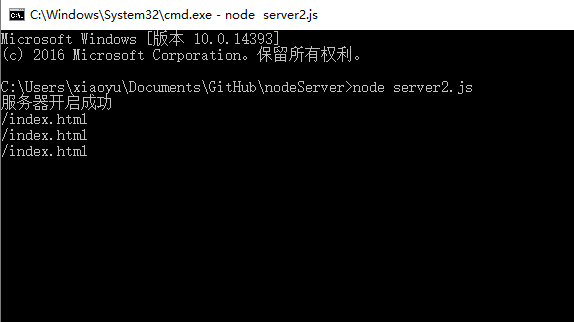
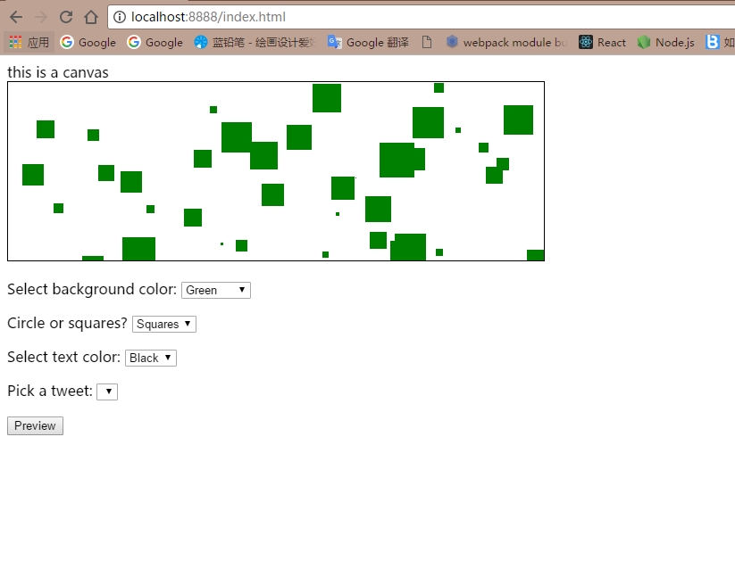
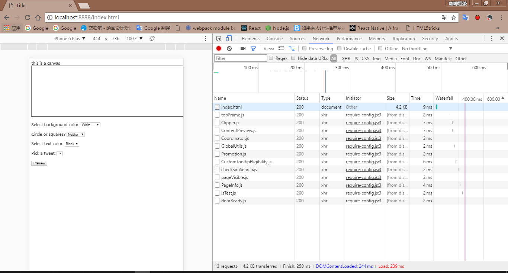

# node-httpServer
其中server.js文件是网上凡是提到使用node创建本地服务器都会贴出来的很流行的10行代码

		var http = require('http');                          //  引入node中的http模块

		var server = http.createServer(function(req,res){    //  http暴露出来的方法用于实例化一个服务器
			console.log('有客户端连接');                     //  当有请求连接时候打印信息

			res.writeHeader(200,{                            //  服务器响应
				'content-type': 'text/html;charset="utf-8"'
			});

			res.write('这是正文部分');
			res.end();
		}).listen(8888);                                     //  监听端口

		console.log('服务器开启成功')

server2.js文件是实际动手将本地C盘目录下写好的一个demo资源文件挂载到搭建的本地服务器上，从而真正实现在本地浏览器中输入localhost:888/index.html就可以访问到页面

		var http = require('http');
		var fs = require('fs');

		var documentRoot = 'C:/test';

		var server = http.createServer(function(req,res){
			var url = req.url;

			var file = documentRoot + url;
			console.log(url);

			fs.readFile(file,function(err,data){
				if(err){
					res.writeHeader(404,{
						'content-type': 'text/html;charset="utf-8"'
					});
					res.write('<h1>404错误</h1>
你要找的页面不存在
');
					res.end();
				}else{
					res.writeHeader(200,{
						'content-type': 'text/html;	charset="utf-8"'
					});
					res.write(data);
					res.end();
				}
			})
		}).listen(8888);

		console.log('服务器开启成功');

#### 以下是服务器运行监听到请求后的控制台输出以及浏览器成功请求到页面的效果

